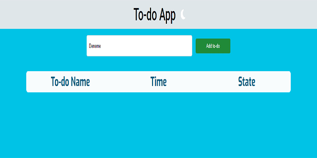

# To-do App
<p align="justify">Simple level generated to-do list application with React</p>
<br>



# How to Run Project
<p align="justify">You must have <b><i>Node.js, pnpm</i></b> installed on your computer.</p>

```bash
# step 1
pnpm install

# step 2
pnpm run dev
```